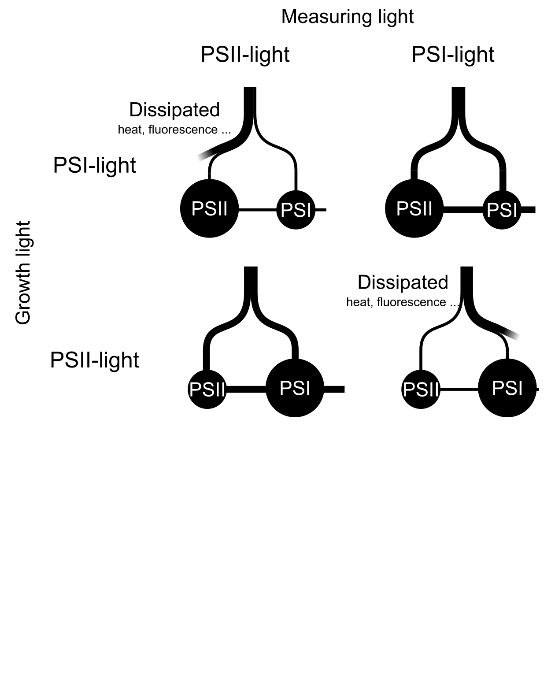
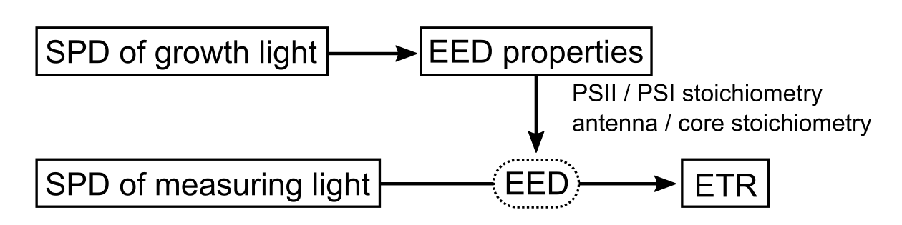

```{r load, echo = F, message = F}
evalFig <- F

if(evalFig){
devtools::source_url("https://raw.githubusercontent.com/KeachMurakami/Sources/master/Startup.R")
  
base_size_default <- 12
R_abs_W <- .79
FR_abs_W <- .262
R_abs_WFR <- .783
FR_abs_WFR <- .20
# R_abs_W <- .93
# FR_abs_W <- .311
# R_abs_WFR <- .922
# FR_abs_WFR <- .267

options(warn = -1)
source("~/Dropbox/Publish/2016R_Fr/Functions_CurveFit.R")
source("~/Dropbox/Publish/2016R_Fr/Pg_Estimate.R")
source("~/Dropbox/Publish/2016PgEstimate/PgAnalyze.R")
source("~/Dropbox/Publish/2016PgEstimate/YieldAnalyze.R")
source("~/Dropbox/Publish/2016PgEstimate/Captions.R")
options(warn = 1)
} else {
library(knitr)
}

opts_chunk$set(echo = FALSE, fig.width = 7.5, fig.height = 7.5, out.width = "100%",
           message = FALSE, warning = FALSE, cache = F, eval = T)
```

```{r Spectra, eval = evalFig}

# set integrate ranges
PFD_integrate_min <- 350
PFD_integrate_max <- 750

IntegratePFD <- 100

# HID_raw <-
#   fread("~/Dropbox/R/spectrum/HID.csv", skip = 13)
# 
# HIDs <-
#   HID_raw %>%
#   setnames(., c("wavelength", paste0("ID", 1:(dim(HID_raw)[2] - 1)))) %>%
#   select(1, HPS_ = 12, MH_ = 21)
FL_Ocean_raw <-
  fread("~/Dropbox/materials/SPD_FL.csv") %>%
  transmute(wavelength = `Wavelength[nm]`, value = FL) %>%
  na.omit

FL_Ocean_PFD <-
  smooth.spline(FL_Ocean_raw$wavelength, FL_Ocean_raw$value) %>%
    predict(., seq(PFD_integrate_min, PFD_integrate_max)) %>%
    .$y %>%
  sum

FL_Ocean <-
  FL_Ocean_raw %>%
  mutate(value = value * 100 / FL_Ocean_PFD, variable = "Fluorescent lamp")


HPS_Ocean_raw <-
  fread("~/Dropbox/materials/SPD_HPS.txt", skip = 50, nrow = 2000) %>%
  rename(wavelength = V1, value = V2)

HPS_Ocean_PFD <-
  smooth.spline(HPS_Ocean_raw$wavelength, HPS_Ocean_raw$value) %>%
    predict(., seq(PFD_integrate_min, PFD_integrate_max)) %>%
    .$y %>%
  sum

HPS_Ocean <-
  HPS_Ocean_raw %>%
  mutate(value = value * 100 / HPS_Ocean_PFD, variable = "High-pressure sodium lamp")


MH_Ocean_raw <-
  fread("~/Dropbox/materials/SPD_MH.txt", skip = 50, nrow = 2000) %>%
  rename(wavelength = V1, value = V2)

MH_Ocean_PFD <-
  smooth.spline(MH_Ocean_raw$wavelength, MH_Ocean_raw$value) %>%
    predict(., seq(PFD_integrate_min, PFD_integrate_max)) %>%
    .$y %>%
  sum

MH_Ocean <-
  MH_Ocean_raw %>%
  mutate(value = value * 100 / MH_Ocean_PFD, variable = "Metal-halide lamp")

OceanSPDs <-
  bind_rows(FL_Ocean, HPS_Ocean, MH_Ocean) %>%
  mutate(panel = "HID, fluorescent lamp")

# FL: FPL55EX-N; IWASAKI ELECTRIC CO., LTD.
# MH: M220FCELS-W/BUD; IWASAKI ELECTRIC CO., LTD.
# HPS: NH220FLS; IWASAKI ELECTRIC CO., LTD.

  

Absorptances <-
  fread("~/Dropbox/materials/SpectrumCucumber.csv") %>%
  filter(Trtm %in% c("W", "WFR", "FL")) %>%
  mutate(wavelength = as.numeric(wavelength)) %>%
  filter(variable == "absorption", Trtm == "W")

Sun <-
  fread("~/Dropbox/materials/Sunlight_JIS.csv") %>%
  setnames(c("wavelength", "Sunlight")) %>%
  left_join(., Absorptances, by = "wavelength") %>%
  transmute(wavelength, Sunlight, `Shaded sunlight` = Sunlight * (100 - ave), Absorptance = ave)

# Sun: JIS C8904-3

LEDs <-
  fread("~/Dropbox/materials/SPD_FL.csv") %>%
  transmute(wavelength = `Wavelength[nm]`, W, FR, B = B_HL, R = R_SR) %>%
  SPDnorm(from = 350, to = 750, integratedPFD = IntegratePFD) %>%
  gather(variable, value, -wavelength) %>%
  mutate(panel = "LED") %>%
  na.omit


SPDs <-
  # left_join(HIDs, Sun, by = "wavelength") %>%
  Sun %>%
  SPDnorm(from = 350, to = 750, integratedPFD = IntegratePFD) %>%
  select(-Absorptance) %>%
  gather(variable, value, -wavelength) %>%
  mutate(panel = "Natural light") %>%
  bind_rows(., OceanSPDs, LEDs) %>%
  filter(between(wavelength, 380, 800)) %>%
  ggplot(aes(x = wavelength, y = value, group = variable, col = variable)) +
  theme_bw2(legend = c(.75, .25)) +
  geom_rect(aes(xmin = 700, xmax = 750, ymin = 0, ymax = +Inf), fill = "grey80", col = NA) +
  geom_line() +
  facet_wrap( ~ panel, ncol = 2) +
  gg_xy(c(380, 800, 0, 4)) +
  xlab("Wavelength [nm]") + ylab(u_SPFD("Spectral photon flux density"))

CapSPD <-
  "Fig. 2 Spectral photon flux density distribution of light. The distributions at a PFD of 100 µmol m<sup>--2</sup> s<sup>--1</sup> within 400--750 nm are shown."
```

```{r InteractionPict, eval = evalFig}

X_div <- 100
X_range <- seq(0, 1, length.out = X_div)


InteractionView <-
  data_frame(X = rep(X_range, times = 2),
           ETR = c(dbeta(X_range, 3, 4.5) * 1.2, dbeta(X_range, 4.5, 3)),
           Trtm = rep(c("W", "WFR"), each = X_div)) %>%
  ggplot(aes(X, ETR, linetype = Trtm, group = Trtm)) +
  theme_bw2(legend = c(.5, .3)) +
  geom_line() +
  scale_linetype_manual(values = c(1, 2)) +
  xlab("The fraction of energy distributed to PSI") +
  ylab("Relative electron transport rate")

CapInteract <-
  "Fig. 2 Spectral photon flux density distribution of light . The distributions at a PFD of 100 µmol m<sup>--2</sup> s<sup>--1</sup> within 400--750 nm are shown."
```

Authors: Keach Murakami^1+^, Ryo Matsuda^1^, and Kazuhiro Fujiwara^1^  

Affiliations: ^1^Graduate School of Agricultural and Life Sciences, The University of Tokyo

Address: ^1^Yayoi, Bunkyo, Tokyo, 113--8657, Japan

e-mail: keach.murakami@gmail.com  


**Abbreviations**
Chl: chlorophyll
ETR: Electron transport rate
FR: far-red
LED: light-emitting diode
*P*~n~: Net photosynthetic rate
PPFD: photosynthetic photon flux density
PSI: photosystem II
PSII: photosystem I
SPD: spectral PFD distribution

------

# Introduction
  
  The net photosynthetic rate (*P*~n~) is one of the most important and commonly reported phenotype in the plant sciences.
  Considering the importance of the photosynthetic rate, the effects on the rates were measured, evaluated, and compared among the leaves cultivated under different conditions, typically the control and treatment.
  The measured *P*~n~ is also used for the estimation of the other photosynthetic parameters, such as initial slope of light response of *P*~n~ and the maximum photosynthetic rate [e.g. @Sharkey_et_al2007PCE].
  Based on the measured rates and estimated parameters, the impacts of the treatments are discussed.
  Thus, the accurate and reliable *P*~n~ measurements must be essential for **the agricultural and horticultural sciences**.
  
  A number of studies have reported that the SPD of light used for the measurement (i.e. measuring light or actinic light) affected the *P*~n~ of leaves [e.g. @McCree1972AM; @Inada1976PCP; @Hogewoning_et_al2012PC].
  To eliminate this direct effect from the comparison, the photosynthetic rates are usually measured under an identical SPD of measuring light irrespective of leaf growth conditions in the agricultural and horticultural researches.
  The most widely-used measuring light might be mixture of blue + red LED light **(BRlight)** provided by light sources installed in commercial photosynthesis analyzing systems.
  Owing to the their regulatability in the incident photon flux density (PFD), the use of the artificial light sources **enables better control of PPFD, and thereby might certificate** the reproducibity of the experimenta.
  
  @Walters2005JXB warned that the measurement with a different SPD of light from **grothw light**, do not necessarily reflect the functioning of the photosynthesis under growth conditions.
  Our recent paper, indeed, experimentally demonstrated this problem in the *P*~n~ measurements [@Murakami_et_al2016PP].
  @Murakami_et_al2016PP grew cucumber seedlings under white LED light without and with supplemental far-red (FR) LED light (W and WFR), and subsequently compared their *P*~n~ under blue + red LED light and the sunlight-like SPD of light.
  The *P*~n~ of W-leaves was greater than that of WFR-leaves under blue + red LED light, while the rates were comparable---or slightly greater in the WFR-leaves---under artificial sunlight.
  Based on the results obtained from the measurement under blue + red LED light, WFR-leaves are evaluated to be less lively and low quality, despite the comparable potential under the sunlight.
  In other words, the SPDs of light incident on the leaf during growth and measurement interacted on the *P*~n~ (唐突感ある).
  If the plants were evaluated without considering the interactions, the selection and decision might be distorted.

  In this short article, we introduce the likely causes of the interaction---the light energy distribution between the photosystic electron transport---and several articles reporting the interaction.
  Subsequently we suggest the situations where the interaction should be cared.
  **We also discuss the practical methods for the *P*~n~ measurements 光質に関した的なフレーズ, and related future works.**
  It is known that the SPD of light affects the instantaneous photosynthesis through the other mechanisms, such as the stomatal response [@Shimazaki_et_al2007AnnRev], photo**inhibition** [@Zavafer_et_al2015JPP] and light penetrating depth within the leaf [@Terashima_et_al2009PCP].
  Although these subjects are not referred in this article, the cited review articles on these topics are available.


  
# How the interactions are generated
  
  The knowledge about the photosynthetic electron transport is required to understand the mechanism of the interaction.
  Light energy absorbed by a leaf drives the electron transport, and thereby the photosynthetic O~2~ evolution and CO~2~ uptake.
  In higher plants, the photosynthetic electron transport chain is anchored by photochemical reactions that occur at two types of photosystems, PSII and PSI.
  The electron transports are powered by excitation energy, which is derived from absorbed photons and transferred to the respective photosystems, thus enabling electron transfer against the redox potential (called the Z scheme).
  Note that the term "energy" is used in 
  Because the photosynthetic electron transport reactions occur in series, the electron transport rate (ETR) through the thylakoid membrane is limited by the slowest step (Fig. 1).
  When PSII absorbs excess excitation energy **under the imbalanced energy distribution**, the energy distribution to PSI limits the ETR and thus the photochemical quantum yield of PSII is lowered **詰まり由来で的フレーズ** (Fig. 1A).
  When PSI absorbs excess excitation energy, the energy distribution to PSII limits the ETR and the yield of PSI is lowered (Fig. 1D).
  In both cases, the excesss energy is dissipated as heat and fluorescence (ROS生成とダメージの話をするか...), and thus the entire photosynthetic quantum yield---ETR per absorbed PFD---becomes smaller.
  Balancing the excitation energy distribution between PSII and PSI is essential for plants to keep the high photosynthetic quantum yield.
  
  <!-- **おまけ部分** -->
  <!-- Note that the balanced distribution might not be a fifty-fifty. -->
  <!-- Even in a dark adapted helthy leaf, the yield of PSII cannot exceed 0.84 (i.e. chl fluorescence parameter *F*~v~/*F*~m~). -->
  <!-- Although there is no clear consensus, the maximum yield of PSI seems to be greater than that of PSII. -->
  <!-- Therefore, under the fifty-fifty distribution, the energy supply to PSII is insufficient and that to PSI is excessive. -->
  <!-- A little bit greater distribution to PSII might be required to make maximum use of the absorbed photons. -->
  <!-- Gentyに触れるか？AEF -->
  
  The imbalance in the energy distribution between the photosystems is supposed to occur ordinarily (どこで？太陽光？).
  PSII and PSI represent different light absorption spectral distributions due to the difference in the compositions of binding pigments, mainly chlorophyll (chl) *a* and *b*.
  Within the chlorophyll (chl) absorption band (approximately 350--750 nm), longer wavelengths of light (> 680--690 nm) are estimated to be preferentially absorbed by PSI, and PSI is drastically overexcited [@Evans1986PhotoPhoto; @Evans1987FPB; @Evans_Anderson1987BBA; @Wientjes_et_al2013BBA; @Laisk_et_al2014BBA].
  Such an umbalanced distribution was caused by the facts that only chl *a* can absorb light within the longer waveband and that PSI contains a greater amount of chl *a* than PSII.
  Monochromatic light at shorter wavelengths (< 680--690 nm) is estimated to be preferentially absorbed by PSII (especially in the wavebands near 470 and 650 nm corresponding to the absorption peaks of chl *b*---abundant in PSII), or evenly absorbed by both photosystems [@Evans1986PhotoPhoto; @Evans1987FPB; @Evans_Anderson1987BBA; @Wientjes_et_al2013BBA; @Laisk_et_al2014BBA].
  These wavelength dependencies of the excitation energy distribution is a determinant of the distribution under a given SPD of light.
  In several studies of the SPD acclimation of the photosynthetic apparatus, light with a given SPD is categorized as either PSII- or PSI-light according to whether the excitation energy is preferentially distributed to PSII or PSI.
  A given SPD of light is classified according to the PFD in the FR waveband in the relative context.
  Thus, the terms ‘PSII-light’ and ‘PSI-light’ are used only in a relative context.
  For instance, a SPD of light, which is evenly absorbed by PSII and PSI in PSII-leaves, can overexcite PSII in PSI-leaves (Fig. 1AB).
  
  Apparently, the excitation energy distribution is affected by the composition of the thylakoid membrane, especially by the stoichiometry between PSII and PSI.
  The stoichiometry is adjusted to the SPD of light during leaf growth [e.g. @Matsuda_et_al2004PCP;].
  Under PSII-light, the relative amount of the reaction center complex of PSII to that of PSI in leaves decreases; conversely, under PSI-light, the relative amount increases to achieve a balance [@Chow_et_al1990PCE; @Chow_et_al1990PNAS; @Smith_et_al1993PCE; @Walters_Horton1994Planta; @Walters_Horton1995bPlanta; @Pfannschmidt_et_al1999Nature; @Wagner_et_al2008Planta; @Hogewoning_et_al2012PC].
  The possible involvement of the change in the composition within the respective photosystems in the SPD acclimation was also suggested [@Walters_Horton1995bPlanta, @Murakami_et_al2016PP].
  These reactions are believed to be induced so that balance the excitation energy distribution.
  The adjustments in the distribution properties of a leaf help the leaves to keep the higher photosynthetic light use efficiency under the growth condition.
  In the short term within an hour, an imbalance in the excitation energy distribution is, at least partly, relieved by the reversible allocation of the light-harvesting antenna complex of PSII (LHCII) between PSII and PSI [state transition; for a review, see @Goldschmidt-Clermont_Bassi2015CurOpin].
  The A slight imbalance in the energy distribution might be covered up by the state transitions.
  The adjustments in the distribution properties are supposed to occur when state transitions are insufficient to counterbalance the uneven excitation energy distribution [@Dietzel_et_al2008FJ].

  The SPD of growth light affects the energy distribution properties of a leaf, which modifies the SPD responses of the leaf ETR (Fig. 2XXX).
  Therefore, the SPDs of growth light and measuring light do not only directly affect the *P*~n~ but also indirectly affect it through their interaction.
  The expected interactions have been reported in several studies [@Chow_et_al1990PNAS; @Walters_Horton1995aPlanta; @Hogewoning_et_al2012PC; @Murakami_et_al2016PP].
  In their pioneering study on *Pisum sativum*, @Chow_et_al1990PNAS grew plants under **cool-white fluorescent lamps with yellow Plexglas** (FR-poor PSII-light) and **incandescent bulbs with red Plexglas** (FR-rich PSI-light) and measured the photosynthetic quantum yield of O~2~ evolution---O~2~ evolution rate per absorbed photons by leaf---under PSII- and PSI-light.
  When measured under PSII-light, the yield was higher in PSII-light-grown leaves; when measured under PSI-light, the yield was higher in PSI-light-grown leaves.
  A similar trends were observed in other studies on *Arabidopsis thaliana* [@Walters_Horton1995aPlanta] and *Cucumis sativus* [@Hogewoning_et_al2012PC; @Murakami_et_al2016PP] (Table. 1).

  The distribution properties of a leaf grown under a SPD of light may be tuned to the light, and thereby is expected to perform a higher ETR per absorbed PFD under the light than under the more PSII-biased- or PSI-biased-light (Fig. 3XXX).
  When leaves grown under different SPDs of light are compared and evaluated under a single-level SPD of light, the results should be inevitably biased by the interaction.


# Where and When the interactions should be cared.

  This interaction **has** considerable impact on the *P*~n~ especially under the light limited and/or CO~2~ sturated conditions, where the **大きさ** of the ETR is dominant factor for the photosynthetic CO~2~ fixation [@von].
  In such conditions, the biases in the ETR directly affect the *P*~n~.
  The photosynthetic yields and the *P*~n~ at light-limited conditions should be measured with particular attentions on the interaction.
  In contrast, under a higher PFDs and/or CO~2~ limtied conditions, the rate is determined by the CO~2~ fixation process in the Calvin cycle rather than the ETR.
  In such conditions, the effects of the biases in the ETR on *P*~n~ may be demagnified.
  In our experiment, however, the interaction was observed under a high PFD (1200 µmol m^--2^ s^--1^) and a low CO~2~ concentration condition (20 Pa in the intercellular space) [@Murakami_et_al2016PP], suggesting the other factor involved in the interaction.

  The mechanisms of the SPD acclimation of **energy distribution** are not yet fully elucidated [see @Murakami_et_al2016PP].
  <!--' @Walters_Horton1995aPlanta confirmed a typical adjustment in the photosystem stoichiometry in response to the slight difference in the SPD of growth light. -->
  <!--' They also found no difference in the stoichiometry between the leaves grown with and without supplemental FR [@Walters_Horton1995bPlanta]. -->
  <!--' Chow and coworkers also reported  -->
  Considering the sensitively adjusted photosystem stoichiometry to the SPD of light [@Walters_Horton1995aPlanta], the interaction should be taken into account whenever the *P*~n~ and related parameters are evaluated.
  The impacts of the interaction on the photosynthetic rates should be payed attention when the rates of leaves, which are expected to **possess** different excitation energy distribution properties, are compared.

  For this decade, a number of studies have been investigated the effects of the SPD of growth light on the plant growth and photosynthesis have been intensively investigated [e.g. @Matsuda_et_al2004PCP; @Matsuda_et_al2007SSPN; @Matsuda_et_al2008PCP; @Hogewoning_et_al2010aJXB; @Hogewoning_et_al2010bJXB; @Shibuya_et_al2015BP; @Trouwborst_et_al2016EEB].
  Assimilation light provided by the most of artificial light sources contain little FR.
  Prevailing fluorescent lamps, metal halide lamps, high-pressure sodium lamps, blue, red, and white LEDs emit typical PSII-light (Fig. 3XXX).
  This is because FR is not "photosynthetic active" and FR-rich light sometimes induces excessive stem elongation.
  Although the *P*~n~ measurements were often made using the blue + red LED light sources, it should be kept in the mind that the responses under the blue + red LED light might be different from those under the PSI-light such as sunlight (Fig. 3XXX).
  When the response under sunlight is the interest of the experiment, we should conduct an experiment under sunlight.
 
  Several recent papers suggest the significance of supplemental FR on the plant growth and development [for a review, see @Demote-Mainard_et_al2016EEB].
  Since FR is prefferentially absorbed by PSI and PSI might be relatively overexcited, the excitation energy distribution property of the leaves grown under PSII-light supplemented with FR LED should differ from those of leaves grown without FR.
  Therefore, comparing the *P*~n~ of leaves grown with and without supplemental FR under the blue + red LED light source might cause a typical interaction, as is demonstrated in the previous report [@Murakami_et_al2016PP].

  The evaluation of the vertical profile of the photosynthetic properties of the leaves from the plant stand cultivated in greenhouses may be biased in the same manner.
  While the leaves in the upper layers were acclimated to sunlight, those in the lower layers were acclimated to the leaf-penetrated light.
  Due to the higher transmittance in the far-red waveband of a leaf, the leaf-penetrated light contains much FR, namely PSI-light (Fig. 3XXX).
  When measured with blue+red LED light, the *P*~n~ of upper leaves might be overestimated while that of lower leaves might be underestimated.

  Note that these interaction should be cared in the evaluations of the other **photosynthesis-related characteristic**.
  The overexicitation of PSII (or PSI) results in the lowered photochemical yield at PSII (or PSI) [e.g. Hogewoning_et_al2012PC].
  Chl fluorescence parameters such as **fai**~PSII~ or NPQ (non-photochemical quenching parameter) should be measured with particular cares.
  The photoinhibition experiments might also be affected the interaction.
  Imbalance in the excitation balance between the photosystems is supposed to acceralate the photoinhibition [@].
  Therefore, evaluating PSI-leaves under PSII-biased actinic light should underestimate **phi~PSII~** and overestimate the photoinhibition in connection to those in the PSII-leaves.


# How the photosynthetic responses should be measured?

  Ideally, the photosynthetic rates should be measured under the *in situ* conditions.
  When the plant growth in the subsequent condition are focused, the rates should be measured under the SPD of light the plant will recieve.
  For instance, commercial transplants are sometimes raised in a closed system with artificial lighting [e.g. @Kozai2007POP], and subsequently transferred to a greenhouse and cultivated under sunlight.
  Therefore, in comparisons of light sources with different SPDs for the transplant production, *P*~n~ measurements should be made under sunlight.
  When the observed differences in the plant growth in the experiments are analyzed, the rates should be measured under the SPDs of light the plants recieved.
  For instance, when the difference in the resultant dry weight between the plants grown under white LEDs and fluorescent lamps are analyzed and the *P*~n~ is used for the explanatory factor, respective growth light must be used for measuring light.
  These simple solutions may eliminate the problems caused by the interaction.
  
  Note that the effect of the interaction on the photosytnehtic rate is not prominent compared to those of the other factors such as PPFD and CO~2~ concentration.
  The fluctuation in the PFD should be removed by using artificial light sources to ensure the reproductivity and reliability of the research.
  The use of artificial light sources might be **inconsistent with the *in situ* measurement because the SPD of light from an artificial light source is generally by far different from that of *in situ* light.** 
  To solve the dilenma between *in situ* evaluation and the PFD stability, the artificial sunlight source might be helpful.

  If the SPD of light the leaves will receive is not predetermined, then *P*~n~ should be measured under both PSII- and PSI-light.
  In this type study, researchers should describe the "general" photosynthetic characteristics of the leaves.
  Therefore, the interaction should be tested so as not to make biased evaluation.
  If the significant interaction is not detected in two-way ANOVA, the main effect of the treatment can be assessed.
  If any the interaction, the results should not be generalized.
  The responses of the rates to both PSII- and PSI-light should be measured, compared, and reported in the paper.
  When **やむおえない事情で位置水準測定をした場合**, the light source of measuring light must be declared in the materials and methods section so that readers can follow the SPD of measuring light.
  The effect of the incteraction should be amplified in the comparison be the leaves with different excitation energy distribution properties.
  The interaction should be taken special care when the cases described in the **former section**.


# Concluding remarks amd future works

  The *P*~n~ measured under a single-level SPD of light is only an aspect of the photosynthetic characteristics of the leaf.
  Therefore, the values must be discussed in connection with the SPD of measuring light.
  Evaluation of the photosynthesis should be made under the *in situ* conditions or multilevels of SPDs of measuring light so that the evaluation is not biased by the interaction.
  Apparently, measuring the photosynthetic rates under multilevels of SPDs costs much more time, resource, and labor.
  In addition that, imitating the various SPDs of light incident on the leaf for *in situ* evaluation of photosythesis might be difficult or impossible from the technical reasons.
  To solve these problems, two processes are remains open;
  1) 
  quantitative evaluation of the excitation energy distribution property of a leaf
  2) 分配特性と分光分布からの電子伝達速度・光合成速度の計算
  the determinant parameters in the SPD-dependence of the photosynthetic ETR should be defined.
  To omit the evaluation of the multi-levels of the SPDs in the descriptive evaluation of the leaf photosynthesis, 






```{r Fig, eval = evalFig, fig.cap = CapSPD}
FigStructure
```

```{r FigSPD, eval = evalFig, fig.cap = CapSPD}
SPDs
```
  
```{r FigInteract, eval = evalFig, fig.cap = CapInteract}
InteractionView
```

<!-- # References -->
