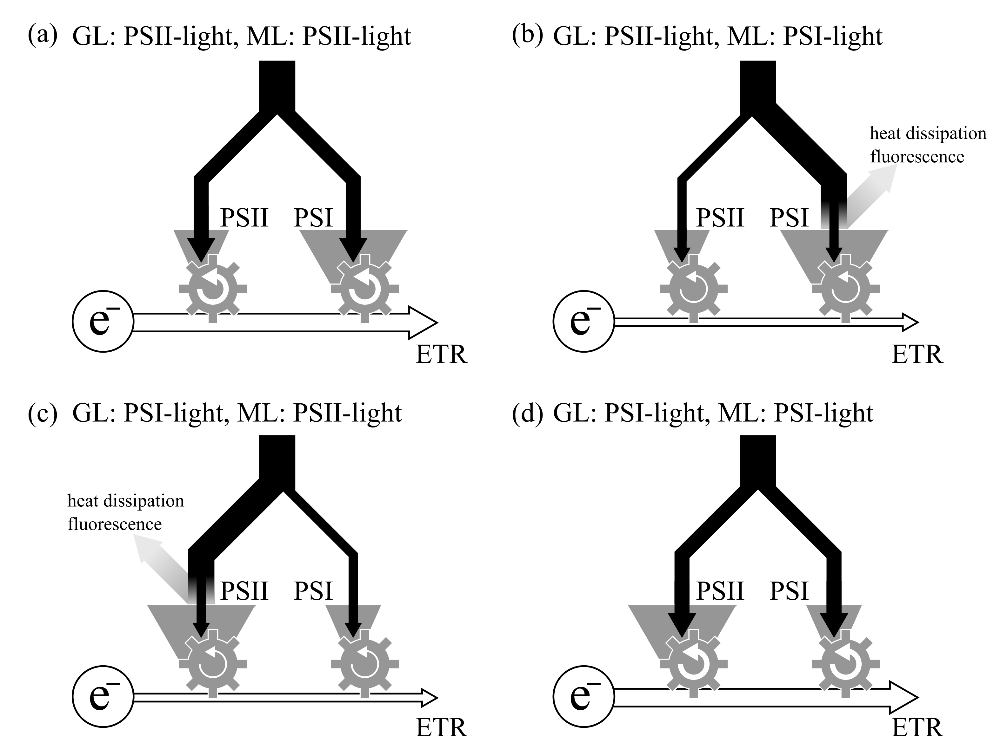

# Introduction

  The photosynthetic rate is one of the most important and fundamental aspects for growth of plants.
  The rates are measured, evaluated, and compared among the leaves cultivated under different conditions.
  The measured rates are also used for the calculation of the other photosynthesis-related indices, such as photosynthetic light-, water-, and nitrogen-use efficiencies.
  In agricultural and horticultural studies, the effectiveness of treatments is sometimes discussed based on the measured photosynthetic rates and calculated indices. 
  Therefore, accurate measurements of the photosynthetic rates must be essential.

  A number of studies have reported that the relative spectral photon-flux-density (PFD) distribution (SPD) of light used for the measurement (i.e. measuring light or actinic light) affected leaf net photosynthetic rates (*P*~n~) [e.g. @McCree1972AM; @Inada1976PCP].
  To eliminate this direct effect from the comparison, *P*~n~ is usually measured under a common SPD of measuring light irrespective of leaf growth conditions in agricultural and horticultural studies.
  One of the most widely-used measuring light is mixture of blue and red light provided by LED light sources (BR-light) installed in commercial photosynthesis analyzing systems (e.g. LI6400 and LI6400XT, LI-COR Inc., Lincoln, NE; GFS-3000, Heinz Walz GmbH, Effeltrich, Germany).
  The use of artificial light sources enables precise control of the photosynthetic PFD (PPFD) and SPD incident on the leaf and therefore ensures the reproducibility and reliability of the experiments.

  @Walters2005JXB pointed out that measuring photosynthetic rates with a SPD of light different from that of growth light do not necessarily reflect the functioning of photosynthesis under growth conditions.
  Our recent study, indeed, experimentally demonstrated this problem in *P*~n~ measurements [@Murakami_et_al2016PP].
  In that experiment, cucumber seedlings were grown under white light-emitting diode (LED) light without and with supplemental far-red (FR) LED light (W and WFR), and subsequently *P*~n~ of the leaves were compared under BR-light and light with the SPD resembling that of sunlight (‘artificial’ sunlight).
  The *P*~n~ of W-grown-leaves was greater than that of WFR-grown-leaves under BR-light, while the rates were comparable under the artificial sunlight [@Murakami_et_al2016PP].
  Based on the results obtained from the measurement under BR-light, the prospective leaf photosynthetic rate of WFR-grown-plants may be evaluated to be smaller than that of W-grown-plants despite the comparable rates under sunlight.

  The effect of the SPD of growth light on *P*~n~ depends on the SPD of measuring light.
  In other words, the SPDs of growth light and measuring light interact on *P*~n~ of a leaf.
  In this short article, we describe a plausible mechanism of the interaction through the excitation balance between the photosystems.
  We then suggest situations in which the interaction should be particularly cared.
  We also discuss the good practice for selecting of the SPD of measuring light for *P*~n~ measurements.
  Several mechanisms other than the excitation balance, such as stomatal responses [@Shimazaki_et_al2007AnnRev], photoinhibition [@Zavafer_et_al2015JPP], and vertical PFD profile within a leaf [@Terashima_et_al2009PCP], affect photosynthesis through the SPD of measuring light.
  Although these subjects are not referred in this article, the cited articles are available for these topics.


# A plausible origin of the interaction

  Fundamental knowledge about the photosynthetic electron transport is required to understand the mechanism of the interaction.
  Light energy absorbed by a leaf drives the photosynthetic electron transport, O~2~ evolution, and CO~2~ uptake.
  In higher plants, the photosynthetic electron transport chain is anchored by photochemical reactions that occur at two types of photosystems, PSII and PSI.
  The excitation energy derived from absorbed photons and transferred to the reaction centers of the photosystems is consumed by the photochemical reactions.
  The serial photochemical reactions at PSII and PSI enable electron transfer from water to NADP^+^, called the Z scheme.
  
  PSII and PSI represent different spectral light absorption distributions due to the difference in the compositions of binding pigments, mainly chl *a* and chl *b*.
  Within the chlorophyll (chl) absorption band (approximately 350--750 nm), longer wavelengths of light (> 680--690 nm) are estimated to be preferentially absorbed by PSI, and PSI is drastically overexcited [Fig. 1; @Evans_Anderson1987BBA; @Hogewoning_et_al2012PC; @Wientjes_et_al2013BBA; @Laisk_et_al2014BBA].
  This is because only chl *a* can absorb longer wavelengths of light and PSI contains a greater amount of chl *a* than PSII.
  In contrast, monochromatic light at shorter wavelengths (< 680--690 nm) is estimated to be preferentially absorbed by PSII, or evenly absorbed by both photosystems [Fig. 1; @Evans_Anderson1987BBA; @Hogewoning_et_al2012PC; @Wientjes_et_al2013BBA; @Laisk_et_al2014BBA].
  These wavelength dependencies of the excitation balance between PSII and PSI determine the excitation energy distribution (EED) under a given SPD of light.
  Light with a given SPD is sometimes categorized as either PSII- or PSI-light according to whether the excitation energy is preferentially distributed to PSII or PSI [e.g. @Chow_et_al1990PNAS; @Melis1991BBA; @Pfannschmidt_et_al2001JBC; @Fan_et_al2007BBA; @Dietzel_et_al2008FJ; @Pfannschmidt_et_al2009AB; @Dietzel_et_al2011PC; @Hogewoning_et_al2012PC].

  Because the photosynthetic electron transport reactions occur in series, the electron transport rate (ETR) through the thylakoid membrane should be limited by the slowest step (Fig. 2).
  When the excitation energy is in excess at PSII (i.e. under PSII-light), the fewer excitation energy distributed to PSI results in the smaller photochemical reaction rate in PSI than that in PSII.
  This shortage in the EED to PSI limits the ETR and therefore the photochemical quantum yield of PSII should be lowered (Fig. 2C).
  When PSI absorbs the excess excitation energy (i.e. under PSI-light), the excitation energy distributed to PSII limits the ETR and the yield of PSI should be lowered (Fig. 2B).
  In both cases, the excess energy is dissipated mainly as heat and fluorescence, and thus the entire photosynthetic quantum yield---ETR per absorbed photons by the leaf---becomes smaller.
  Therefore, balancing the EED between PSII and PSI is essential for plants to keep the high photosynthetic quantum yield.
  Imbalanced excitation between the photosystems is supposed to harm leaves by generating reactive oxygen species, which cause oxidative damage to chloroplast components [for reviews, see @Asada1999AnnRev; @Asada2006PP].

  Apparently, the EED at a given SPD of light is also affected by the composition of the thylakoid components, especially by the stoichiometry between PSII and PSI.
  The stoichiometry seems to be adjusted to the SPD of growth light.
  Under PSII-light, the relative amount of the reaction center complex of PSII to that of PSI in leaves decreases; conversely, under PSI-light, the relative amount increases to achieve a balance [e.g. @Melis1991BBA; @Pfannschmidt_et_al1999Nature].
  These adjustments in the EED properties might help the leaves to keep the high photosynthetic quantum yield under growth light [@Chow_et_al1990PNAS].
  As a result of these resposes adjusting the EED properties of a leaf, the spectrum of excitation balance (Fig. 1) differs depending on the SPD of grown light.
  The categories of light---‘PSII-light’ and ‘PSI-light’---are defined for a given leaf in the relative scale, not in the absolute scale.
  For instance, a SPD of light, which is evenly absorbed by PSII and PSI in PSII-light-grown leaves (Fig. 2A), can overexcite PSII in PSI-light-grown leaves (Fig. 2C).
  Therefore, the terms ‘PSII-light’ and ‘PSI-light’ are used only in a relative context.
  In the short term within an hour, an imbalance in the EED is, at least partly, relieved by the reversible allocation of the light-harvesting antenna complex of PSII (LHCII) between PSII and PSI [state transition; for a review, see @Goldschmidt-Clermont_Bassi2015CurOpin].
  Although a slight imbalance in the EED might be compensated for by the state transitions, the long-term adjustments in the EED properties are supposed to occur when state transitions are insufficient to counterbalance the uneven EED [@Dietzel_et_al2008FJ].

  The SPD of growth light affects the EED properties of a leaf, which modifies the responses of ETR and thereby *P*~n~ to the SPD of measuring light.
  Thus, the SPDs of growth light and measuring light do not only directly affect the *P*~n~ but also indirectly affect it through their interaction.
  The expected interaction has been reported in several studies [@Chow_et_al1990PNAS; @Walters_Horton1995aPlanta; @Hogewoning_et_al2012PC; @Murakami_et_al2016PP].
  In their pioneering study, @Chow_et_al1990PNAS grew *Pisum sativum* plants under light provided by cool-white fluorescent lamps with yellow Plexiglas (PSII-light) and incandescent bulbs with red Plexiglas (PSI-light) and measured the photosynthetic quantum yield of O~2~ evolution---O~2~ evolution rate per absorbed photons by the leaf---under the PSII- and PSI-light reciprocally.
  When measured under the PSII-light, the yield was higher in the PSII-light-grown leaves; when measured under the PSI-light, the yield was higher in the PSI-light-grown leaves.
  Similar trends were observed in *Arabidopsis thaliana* [@Walters_Horton1995aPlanta] and *Cucumis sativus* in the photosynthetic quantum yield of CO~2~ uptake [@Hogewoning_et_al2012PC] and in the *P*~n~ [see also Introduction; @Murakami_et_al2016PP].

  These reports suggest that the EED properties of a leaf might be tuned to the PSII/PSI-biased level of growth light.
  It is expected that a leaf performs a higher ETR per absorbed photons by the leaf under measuring light with a PSII/PSI-biased level similar to that of growth light (Fig. 3).
  When leaves grown under different SPDs of light are compared and evaluated under a specific SPD of light, the results should be inevitably biased depending on the SPD of measuring light.


# Some situations in which the interaction should be concerned

  The interaction may have considerable impact on *P*~n~ especially measured under low PPFDs and/or high CO~2~ concentrations, where the ETR is a limiting factor for the photosynthetic CO~2~ fixation [@vonCaemmerer_Farquhar1981Planta].
  Under such conditions, any bias in the ETR is directly reflected in *P*~n~.
  Therefore, the *P*~n~ under these conditions should be measured with particular attention on the interaction.

  The mechanisms of the acclimation of the EED properties to SPD have not yet been fully elucidated [see @Murakami_et_al2016PP].
  Considering the sensitively adjusted photosystem stoichiometry in response to the SPD of growth light [@Walters_Horton1995aPlanta], the interaction should always be taken into account whenever the *P*~n~ and related indices are compared among the leaves grown under different SPDs of light.
  Particular attention should be paid to the impacts of the interaction on the *P*~n~, at least when the measured leaves are expected to represent different EED properties.
  
  For this decade, a number of studies have investigated the effects of SPD of growth light on plant growth and photosynthesis [e.g. @Matsuda_et_al2004PCP; @Matsuda_et_al2007SSPN; @Matsuda_et_al2008PCP; @Hogewoning_et_al2010aJXB; @Hogewoning_et_al2010bJXB; @Shibuya_et_al2015BP; @Trouwborst_et_al2016EEB].
  Growth light provided by most of artificial light sources contains little FR light.
  In general, fluorescent lamps, metal halide lamps, high-pressure sodium lamps, and blue, red, and white LEDs used for assimilation lighting all emit typical PSII-light (Fig. 4).
  This is because FR light is hardly ‘photosynthetically active’ and FR light promotes excessive stem elongation.
  On the other hand, several recent papers suggest the significance of supplemental FR light on plant growth and development [for a review, see @Demotes-Mainard_et_al2016EEB].
  Since FR light overexcites PSI, leaves grown under PSII-light with supplemental FR light can represent relatively PSI-leaves like EED properties compared to those grown without supplemental FR light.
  Therefore, comparing the *P*~n~ of leaves grown with and without supplemental FR light using BR-light as measuring light might result in typical biased evaluation due to the interaction, as demonstrated in the previous report [@Murakami_et_al2016PP].

  Evaluating vertical profiles of leaf photosynthetic characteristics of a plant stand cultivated in greenhouses may be vulnerable to the biases in the same manner.
  While leaves in the upper layers were acclimated to sunlight, those in the lower layers were acclimated to light that has penetrated the upper leaves.
  Due to the higher transmittance in the FR waveband of a leaf, the transmitted light incident on lower leaves contains a relatively greater proportion of FR light (Fig. 4) and is namely PSI-light.
  Therefore, when measured using BR-light, the *P*~n~ of upper leaves might be overestimated while that of lower leaves might be underestimated.


# Appropriate SPDs of measuring light for evaluating photosythetic rates

  Ideally, photosynthetic rates and related indices should be measured under *in situ* conditions.
  In prospective studies focusing on plant growth after the measurements, the measurements should be made under the SPD of light that the plant will be subject to.
  For instance, in case of evaluation of the transplants grown under artificial lighting [e.g. @Kozai2007POP] from the the prospective viewpoint, the measurements should be made under sunlight because they are subsequently transferred to a greenhouse and cultivated under sunlight.
  However, the measurements under sunlight might become uncertain due to fluctations in the incident PPFD.
  SPD-controllable light sources might be helpful [e.g. @Yano_Fujiwara2012PM; @Fujiwara_et_al2013Proc] to make *in situ* evaluation under a PPFD stable condition and to ensure the reproducibility and reliability of studies.
  In retrospective studies aiming to elucidate causes of differences between the experimental groups, the measurements should be made under the SPDs of light that the plants have received during the treatments.
  For instance, when the difference in the resultant dry weight between the plants grown under white LEDs and fluorescent lamps are analyzed and the *P*~n~ is used for an explanatory variable, the measurements should be made using the white LEDs for the plants grown under the white LEDs and using the fluorescent lamps for those grown under the fluorescent lamps.
  In both prospective and retrospective studies, these simple *in situ* measurements will eliminate the problems caused by the interaction.

  On the other hand, in descriptive studies making no assumption as to *in situ* condition, the measurements should be made under several SPDs of light including PSII- and PSI-light.
  Researchers had better report the ‘general’ characteristics of the leaves in these studies.
  Therefore, the interaction should be tested so as not to make biased evaluation.
  If any the interaction, the results should be descriptively reported and should not be generalized.
  When the measurements were made only under a single-pattern of SPD of measuring light because of unavoidable circumstances, the light source must be declared in the materials and methods section so that readers can follow the SPD.


# Concluding remarks

  The *P*~n~ under a single-pattern SPD of measuring light is only an aspect of the photosynthetic characteristics of the leaf.
  Therefore, the obtained result must be discussed in connection with the SPD of measuring light.
  Evaluation of the photosynthesis should be made under the *in situ* conditions or multi-pattern of SPDs of measuring light so that the evaluation is not biased by the interaction.
  Imitating the various SPDs of light incident on the leaf for *in situ* evaluation might be difficult or impossible from the technical reasons.
  In addition, measuring the *P*~n~ under multi-pattern of SPDs is time-, resource-, and labor-consuming.
  Although these two approaches might not always be applied for evaluation of leaf *P*~n~, the interaction should always be kept in mind to make circumspect conclusions.


**Acknowledgements**

  We thank Dr Sander W. Hogewoning (Plant Lighting B.V., the Netherlands) for providing data of absorpbance spectra of photosystems.
  This work was supported by JSPS KAKENHI Grant Number 26·9372.

```{r Captions}
CapEED <-
  "Fig. 1  Excitation balance between photosystems in response to wavelength of measuring light. The spectrum was calculated from absorbance spectra of PSII and PSI complexes in solvent (Hogewoning et al. 2012)."

CapETRs <-
  "Fig. 2  Conceptual diagrams of the effects of the excitation energy distribution between the photosystems (PSII and PSI) on the photosynthetic electron transport rate (ETR). Electron flow (grey lines) and energy flow (black lines) of leaves grown under PSII-light (A, B) and PSI-light (C, D) measured using PSII-light (A, C) and PSI-light (B, D) were shown. "

CapInteract <-
  "Fig. 3  Conceptual diagram of the photosynthetic electron transport rates per absorbed photons by the leaf grown under PSII-light (PSII-leaves) and PSI-light (PSI-leaves) in response to the PSII/PSI-bised level of measuring light."

CapSPD <-
  'Fig. 4  Spectral photon flux density distributions of light provided by (a) fluorescent lamp (FL; FPL55EX-N<sup>1</sup>), metal halide lamp (MH; M220FCELS-W/BUD<sup>1</sup>), and, high-pressure sodium lamp (HPS; NH220FLS<sup>1</sup>), (b) blue (B; HBL3-3S55-LE<sup>2</sup>), red (R; SRK3-3A80-LE<sup>2</sup>), far-red (FR; L735-36AU<sup>3</sup>), and white (W; NSPW310DS<sup>4</sup>) light-emitting diodes, and (c) incident and leaf transmitted sunlight. The distributions at a photon flux density of 100 µmol m<sup>--2</sup> s<sup>--1</sup> within 400--750 nm are shown. The far-red waveband (700--750 nm) is filled in grey. The distribution of sunlight was adopted from the International Electrotechnical Commission Standard 60904–3 [@IEC2007]. The distribution of the leaf transmitted sunlight was calculated from that of incident sunlight and the transmittance spectrum of a cucumber leaf (Murakami et al. 2016).<br><sup>1</sup>IWASAKI ELECTRIC CO., LTD, Tokyo, Japan; <sup>2</sup>Tricon Co., Shimane, Japan; <sup>3</sup>Epitex Inc., Kyoto, Japan; <sup>4</sup>Nichia Chemical Industries Ltd., Tokushima, Japan.'
```

```{r InteractionPict, eval = evalFig}

X_div <- 101
X_range <- seq(0, 1, length.out = X_div)
x_breaks <- c(0.2, 0.4, 0.65)


InteractionDat <-
  data_frame(X = rep(X_range, times = 2),
           ETR = c(sqrt(dbeta(X_range, 4.5, 3.5)) * 1.1, sqrt(dbeta(X_range, 3, 5))),
           Trtm = rep(c("PSII-leaves", "PSI-leaves"), each = X_div))

InteractionLabel <-
  InteractionDat %>%
  group_by(Trtm) %>%
  summarise(ETR = max(ETR)) %>%
  left_join(., InteractionDat, by = c("Trtm", "ETR"))

InteractionPoint <-
  InteractionDat %>%
  filter(X %in% x_breaks)
  
InteractionText <-
  InteractionDat %>%
  filter(X %in% x_breaks) %>%
  mutate(labels = c("far-red LED light", "Sunlight", "blue + red LED light", rep("", length(x_breaks)))) %>%
  mutate(ETR = c(0.1, 0.1, 0.1, numeric(length(x_breaks))))

InteractionView <-
  InteractionDat %>%
  ggplot(aes(X, ETR, linetype = Trtm, fill = Trtm, group = Trtm)) +
  theme_bw2() +
  theme(axis.text.y = element_blank(),
        axis.ticks = element_blank(),
        panel.grid.major = element_blank()) +
  geom_vline(aes(xintercept = x_breaks[1]), linetype = 3, size = .75, col = "grey") +
  geom_vline(aes(xintercept = x_breaks[2]), linetype = 3, size = .75, col = "grey") +
  geom_vline(aes(xintercept = x_breaks[3]), linetype = 3, size = .75, col = "grey") +
  geom_line() +
  geom_point(data = InteractionPoint, col = "black", size = 3, shape = 21) +
  geom_text(data = InteractionLabel, aes(x = X, y = ETR, label = Trtm), vjust = -1) +
  geom_text(data = InteractionText, aes(label = labels), vjust = 1) +
  scale_fill_manual(values = c("white", "black")) +
  scale_linetype_manual(values = c(2, 1)) +
  scale_x_continuous(breaks = c(0.07, 0.92), limits = c(0.05, 0.95), labels = c("PSI-biased", "PSII-biased")) +
  xlab("PSII/PSI-biased level of measuring light") +
  ylab("Relative electron transport rate") +
  gg_y(c(0, 2))
```

```{r EED, eval = evalFig}
library(EBImage)
which_mean <- function(x) x %>% which %>% mean
Join_by <- function(x, y) join(x, y, by = "wavelength")

  Hoge_PSII <- readImage("~/Dropbox/Publish/2016PgEstimate/Data/Hoge_PSII.png")
  Hoge_PSI <- readImage("~/Dropbox/Publish/2016PgEstimate/Data/Hoge_PSI.png")
  
  Abs_PSII <-
    (Hoge_PSII[, , 1] < .8 & Hoge_PSII[, , 3] > .8) %>%
    .@.Data %>%
    data.frame %>%
    t %>%
    aaply(.margins = 2, .fun = which_mean) %>%
    data.frame(wavelength = seq(400, 800, by = 1), abs = (dim(Hoge_PSII)[2] - .)) %>%
    select(wavelength, PSII = abs)
  
  Abs_PSI <-
    (Hoge_PSI[, , 1] > .8 & Hoge_PSI[, , 3] < .8) %>%
    .@.Data %>%
    data.frame %>%
    t %>%
    aaply(.margins = 2, .fun = which_mean) %>%
    data.frame(wavelength = seq(400, 800, by = 1), abs = (dim(Hoge_PSI)[2] - .)) %>%
    select(wavelength, PSI = abs)
  
Mole_abs <-
  Reduce(Join_by, list(Abs_PSII, Abs_PSI)) %>%
  filter(wavelength %% 1 == 0) %>%
  na.omit

EED_dat <-
  Mole_abs %>%
  transmute(
    wavelength,
    AlltoPSII = PSII / (1.5 * PSI + PSII)
  )

EEDs <-
  EED_dat %>%
    mutate(All2_for = c(tail(EED_dat$AlltoPSII, -1), 0),
           All2_back = c(0, head(EED_dat$AlltoPSII, -1)),
           AlltoPSII = (AlltoPSII + All2_for + All2_back) / 3) %>% # get moving average
    filter(wavelength > 400)  %>%
    replace_na(list(AlltoPSII = 0)) %>%
    ggplot(aes(x = wavelength, y = AlltoPSII)) +
    theme_bw2() +
    theme(panel.grid.major = element_blank()) +
    geom_hline(yintercept = 0.5, col = "grey50", linetype = 3) +
    gg_x(c(380, 770)) +
    # geom_ribbon(aes(ymin = AlltoPSII_max, ymax = AlltoPSII_min), col = "grey50") +
    geom_line() +
    scale_y_continuous(labels = c("0    ", "0.25", "0.50", "0.75", "1.00"),
                       breaks = c(0, 0.25, 0.5, 0.75, 1),
                       limits = c(0, 1.0),
                       expand = c(0, 0)) +
    xlab("Wavelength [nm]") + ylab("Fraction of the excitation energy distributed to PSII")
```

```{r Spectra, eval = evalFig}

# set integrate ranges
PFD_integrate_min <- 350
PFD_integrate_max <- 750

IntegratePFD <- 100

panel_names <- c("(a)", "(b)", "(c)")

FL_Ocean_raw <-
  fread("~/Dropbox/materials/SPD_FL.csv") %>%
  transmute(wavelength = `Wavelength[nm]`, value = FL) %>%
  na.omit

FL_Ocean_PFD <-
  smooth.spline(FL_Ocean_raw$wavelength, FL_Ocean_raw$value) %>%
    predict(., seq(PFD_integrate_min, PFD_integrate_max)) %>%
    .$y %>%
  sum

FL_Ocean <-
  FL_Ocean_raw %>%
  mutate(value = value * 100 / FL_Ocean_PFD, variable = "FL")

HPS_Ocean_raw <-
  fread("~/Dropbox/materials/SPD_HPS.txt", skip = 50, nrow = 2000) %>%
  rename(wavelength = V1, value = V2)

HPS_Ocean_PFD <-
  smooth.spline(HPS_Ocean_raw$wavelength, HPS_Ocean_raw$value) %>%
    predict(., seq(PFD_integrate_min, PFD_integrate_max)) %>%
    .$y %>%
  sum

HPS_Ocean <-
  HPS_Ocean_raw %>%
  mutate(value = value * 100 / HPS_Ocean_PFD, variable = "HPS")

MH_Ocean_raw <-
  fread("~/Dropbox/materials/SPD_MH.txt", skip = 50, nrow = 2000) %>%
  rename(wavelength = V1, value = V2)

MH_Ocean_PFD <-
  smooth.spline(MH_Ocean_raw$wavelength, MH_Ocean_raw$value) %>%
    predict(., seq(PFD_integrate_min, PFD_integrate_max)) %>%
    .$y %>%
  sum

MH_Ocean <-
  MH_Ocean_raw %>%
  mutate(value = value * 100 / MH_Ocean_PFD, variable = "MH")

OceanSPDs <-
  bind_rows(FL_Ocean, HPS_Ocean, MH_Ocean) %>%
  mutate(panel = panel_names[1])

Absorptances <-
  fread("~/Dropbox/materials/SpectrumCucumber.csv") %>%
  filter(Trtm %in% c("W", "WFR", "FL")) %>%
  mutate(wavelength = as.numeric(wavelength)) %>%
  filter(variable == "absorption", Trtm == "W")

# Sun: JIS C8904-3
Sun <-
  fread("~/Dropbox/materials/Sunlight_JIS.csv") %>%
  setnames(c("wavelength", "Sunlight")) %>%
  left_join(., Absorptances, by = "wavelength") %>%
  transmute(wavelength, Sun = Sunlight, Shade = Sunlight * (100 - ave), Absorptance = ave)

LEDs <-
  fread("~/Dropbox/materials/SPD_FL.csv") %>%
  transmute(wavelength = `Wavelength[nm]`, W, FR, B = B_HL, R = R_SR) %>%
  SPDnorm(from = 350, to = 750, integratedPFD = IntegratePFD) %>%
  gather(variable, value, -wavelength) %>%
  mutate(panel = panel_names[2]) %>%
  na.omit

SPD_labels <-
  data_frame(variable = c("FL", "MH", "HPS", "B", "R", "FR", "W", "Sun", "Shade"),
             wavelength = c(435, 520, 570, 448, 660, 735, 460, 450, 700),
             value = c(2.2, .6, 3, 4, 4.2, 3.8, 1.3, 0.6, 2),
             label = c("FL", "MH", "HPS", "B", "R", "FR", "W", "Sunlight", "Leaf transmitted sunlight"),
             panel = rep(panel_names,  c(3, 4, 2)))

SPD_panel <-
  data_frame(variable = "FL",
           wavelength = 400, value = 4,
           label = letters[1:3],
           panel = rep(panel_names))

SPDs <-
  Sun %>%
  SPDnorm(from = 350, to = 750, integratedPFD = IntegratePFD) %>%
  select(-Absorptance) %>%
  gather(variable, value, -wavelength) %>%
  mutate(panel = panel_names[3]) %>%
  bind_rows(., OceanSPDs, LEDs) %>%
  filter(between(wavelength, 380, 820)) %>%
  ggplot(aes(x = wavelength, y = value, group = variable, col = variable, linetype = variable)) +
  theme_bw2() +
  theme(strip.background = element_blank(),
        strip.text = element_blank(),
        panel.grid.major = element_blank()) +
  geom_rect(aes(xmin = 700, xmax = 750, ymin = 0, ymax = +Inf), fill = "grey90", col = NA) +
  geom_line() +
  geom_text(data = SPD_labels, aes(x = wavelength, y = value, label = label)) +
  geom_text(data = SPD_panel, col = "black", aes(label = panel)) +
  scale_linetype_manual(values = c(1, 1, 3, 2, 4, 2, 2, 1, 4)) +
  scale_color_manual(values = c("blue", "black", "darkred", "orange", "purple", "red", "grey25", "black", "black")) +
  facet_grid(panel ~ .) +
  gg_xy(c(380, 820, 0, 4.5)) +
  xlab("Wavelength [nm]") + ylab(u_SPFD("Spectral photon flux density"))

```

```{r, eval = evalFig, html.cap = CapEED}
EEDs
```


```{r, eval = evalFig, html.cap = CapETRs}

```


```{r, eval = evalFig, html.cap = CapInteract}
InteractionView
```


```{r, eval = evalFig, html.cap = CapSPD}
SPDs
```
