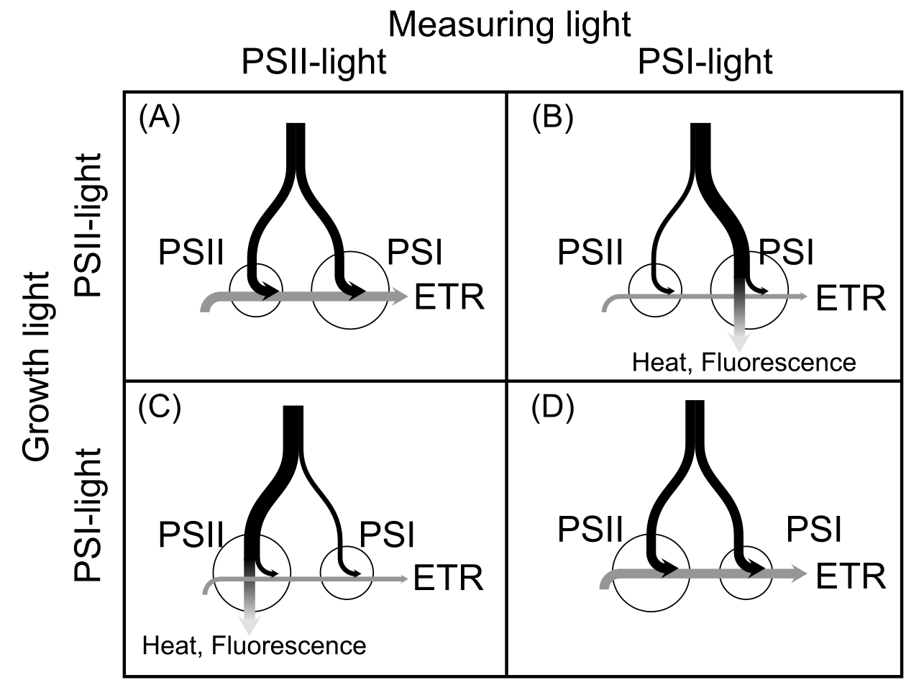

```{r load, echo = F, message = F}
devtools::source_url("https://raw.githubusercontent.com/KeachMurakami/Sources/master/Startup.R")
opts_chunk$set(echo = FALSE, fig.width = 7.5, fig.height = 7.5, out.width = "100%",
           message = FALSE, warning = FALSE, cache = F, eval = T)

base_size_default <- 12

options(warn = -1)
options(warn = 1)
```

```{r Spectra}

# set integrate ranges
PFD_integrate_min <- 350
PFD_integrate_max <- 750

# HID_raw <-
#   fread("~/Dropbox/R/spectrum/HID.csv", skip = 13)
# 
# HIDs <-
#   HID_raw %>%
#   setnames(., c("wavelength", paste0("ID", 1:(dim(HID_raw)[2] - 1)))) %>%
#   select(1, HPS_ = 12, MH_ = 21)
FL_Ocean_raw <-
  fread("~/Dropbox/materials/SPD_FL.csv") %>%
  transmute(wavelength = `Wavelength[nm]`, value = FL) %>%
  na.omit

FL_Ocean_PFD <-
  smooth.spline(FL_Ocean_raw$wavelength, FL_Ocean_raw$value) %>%
    predict(., seq(PFD_integrate_min, PFD_integrate_max)) %>%
    .$y %>%
  sum

FL_Ocean <-
  FL_Ocean_raw %>%
  mutate(value = value * 100 / FL_Ocean_PFD, variable = "FL")


HPS_Ocean_raw <-
  fread("~/Dropbox/materials/SPD_HPS.txt", skip = 50, nrow = 2000) %>%
  rename(wavelength = V1, value = V2)

HPS_Ocean_PFD <-
  smooth.spline(HPS_Ocean_raw$wavelength, HPS_Ocean_raw$value) %>%
    predict(., seq(PFD_integrate_min, PFD_integrate_max)) %>%
    .$y %>%
  sum

HPS_Ocean <-
  HPS_Ocean_raw %>%
  mutate(value = value * 100 / HPS_Ocean_PFD, variable = "HPS")


MH_Ocean_raw <-
  fread("~/Dropbox/materials/SPD_MH.txt", skip = 50, nrow = 2000) %>%
  rename(wavelength = V1, value = V2)

MH_Ocean_PFD <-
  smooth.spline(MH_Ocean_raw$wavelength, MH_Ocean_raw$value) %>%
    predict(., seq(PFD_integrate_min, PFD_integrate_max)) %>%
    .$y %>%
  sum

MH_Ocean <-
  MH_Ocean_raw %>%
  mutate(value = value * 100 / MH_Ocean_PFD, variable = "MH")


# MH: M220FCELS-W/BUD; IWASAKI ELECTRIC CO., LTD.
# HPS: NH220FLS; IWASAKI ELECTRIC CO., LTD.

  

Absorptances <-
  fread("~/Dropbox/materials/SpectrumCucumber.csv") %>%
  filter(Trtm %in% c("W", "WFR", "FL")) %>%
  mutate(wavelength = as.numeric(wavelength)) %>%
  filter(variable == "absorption", Trtm == "W")

Sun <-
  fread("~/Dropbox/materials/Sunlight_JIS.csv") %>%
  setnames(c("wavelength", "Sun")) %>%
  left_join(., Absorptances, by = "wavelength") %>%
  transmute(wavelength, Sun, TransSun = Sun * (100 - ave), Absorptance = ave)

# Sun: JIS C8904-3

# LEDs <-


SPDs <-
  # left_join(HIDs, Sun, by = "wavelength") %>%
  Sun %>%
  SPDnorm(from = 350, to = 750, integratedPFD = 100) %>%
  select(-Absorptance) %>%
  gather(variable, value, -wavelength) %>%
  bind_rows(., FL_Ocean) %>%
  bind_rows(., HPS_Ocean) %>%
  bind_rows(., MH_Ocean) %>%
  filter(between(wavelength, 350, 800)) %>%
  ggplot(aes(x = wavelength, y = value, group = variable, col = variable)) +
  theme_bw2(legend = "right") +
  geom_line() +
  xlab("Wavelength [nm]") + ylab(u_SPFD("Spectral photon flux density"))

CapSPD <-
  "Fig. 2 Spectral photon flux density distribution of light . The distributions at a PFD of 100 µmol m<sup>--2</sup> s<sup>--1</sup> within 400--750 nm are shown."
```

```{r InteractionPict}

X_div <- 100
X_range <- seq(0, 1, length.out = X_div)


InteractionView <-
  data_frame(X = rep(X_range, times = 2),
           ETR = c(dbeta(X_range, 2, 4) * 1.2, dbeta(X_range, 3, 2)),
           Trtm = rep(c("W", "WFR"), each = X_div)) %>%
  ggplot(aes(X, ETR, col = Trtm, group = Trtm)) +
  theme_bw2() +
  geom_line()

CapInteract <-
  "Fig. 2 Spectral photon flux density distribution of light . The distributions at a PFD of 100 µmol m<sup>--2</sup> s<sup>--1</sup> within 400--750 nm are shown."
```

Authors: Keach Murakami^1+^, Ryo Matsuda^1^, and Kazuhiro Fujiwara^1^  

Affiliations: ^1^Graduate School of Agricultural and Life Sciences, The University of Tokyo

Address: ^1^Yayoi, Bunkyo, Tokyo, 113--8657, Japan

e-mail: keach.murakami@gmail.com  


**Abbreviations**
ETR: 
ML: measuring light
Pn: 
PPFD: photosynthetic photon flux density
SPD: spectral PFD distribution

------

# Introduction
  
  The net photosynthetic rate is one of the most important and commonly reported phenotype for the plant sciences.
  Considering the importance of the photosynthetic rate, the effects on the rates were measured, evaluated, and compared among the leaves cultivated under different conditions, typically control and treatment.
  Based on the measured rates, the impacts of the treatments are discussed.
  Thus, the reliable measurements must be made prior to the evaluation.
  
  A number of studies have reported that the SPD of the ML affected the *P*~n~ of leaves [e.g. @McCree1972AM; @Inada1976PCP; @Hogewoning_et_al2012PC].
  To eliminate this direct effect, the photosynthetic parameters usually measured under identical SPD conditions in the agricultural and horticultural researches.
  The most prevailing light source might be blue and red LED light sources.
  
  However, our recent paper demonstrated that the light source cannot evaluate the instantaneous leaf photosynthetic properties in some cases [@Murakami_et_al2016PhysiolPlant].
  @Murakami_et_al2016PhysiolPlant compared the photosynthetic rates of leaves grown under white LED light without and with supplemental far-red LED light (W- and WFR-leaves) using blue-red LED light source sunlight-like SPD of light.
  The photosynthetic rate of W-leaves was greater than that of WFR-leaves under BR LED light (i.e. PSII-light), while the rates were comparable between the leaves, or slightly greater in the WFR-leaves, under sunlight (i.e. PSI-light).
  In other words, the SPDs of light incident on the leaf during growth and the measurement interacts on the photosynthetic rates.
  If the plants were evaluated without considering the interactions, the selection and decision might be distorted.

  In this short review, we introduce the papers reporting the interaction and its likely causes, the light energy distribution between the photosystic electron transport.
  Subsequently we discuss the practical situations where the interaction should be cared and the recomended measuring methods in the measurements of the photosynthetic rates.
  It is known that the SPD of light affects the instantaneous photosynthetic rate through the other mechanisms, such as the stomatal response [@Shimazaki_et_al2007AnnRev], photo**inhibition** [@Zavafer_et_al2015JPP] and light penetrating depth within the leaf [@Terashima_et_al2009PCP].
  Thought these subjects are not referred in this article, the cited review articles on these topics are available.

  
# How the interactions are generated
  
  The knowledge about the photosynthetic electron transport is required to understand the mechanism of the interaction.
  Light energy absorbed by a leaf drives the electron transport, and thereby the photosynthetic O~2~ evolution and CO~2~ uptake.
  In higher plants, the photosynthetic electron transport chain is anchored by photochemical reactions that occur at two types of photosystems, PSII and PSI.
  The electron transports are powered by photon energy transferred to the respective photosystems, thus enabling electron transfer against the redox potential (called the Z scheme).
  Because photosynthetic electron transport reactions occur in series, the electron transport rate (ETR) through the thylakoid membrane is limited by the slowest step (Fig. 1).
  When PSII absorbs excess energy **under the imbalanced energy distribution**, the energy distribution to PSI limits the ETR and thus the photochemical quantum yield of PSII is lowered (Fig. 1A).
  When PSI absorbs excess energy, the energy distribution to PSII limits the ETR and the yield of PSI is lowered (Fig. 1D).
  In both cases, the excesss energy is dissipated as heat and fluorescence (ROS生成とダメージの話をするか...), and thus the entire photosynthetic quantum yield---the ETR per absorbed photon---becomes smaller.
  Balancing the excitation energy distribution between PSII and PSI is essential for plants to keep the high photosynthetic quantum yield.
  
  **おまけ部分**
  Note that the balanced distribution might not be a fifty-fifty.
  Even in a dark adapted helthy leaf, the yield of PSII cannot exceed 0.84 (i.e. chl fluorescence parameter *F*~v~/*F*~m~).
  Although there is no clear consensus, the maximum yield of PSI seems to be greater than that of PSII.
  Therefore, under the fifty-fifty distribution, the energy supply to PSII is insufficient and that to PSI is excessive.
  A little bit greater distribution to PSII might be required to make maximum use of the absorbed photons.
  Gentyに触れるか？AEF
  
  The imbalance in the energy distribution between the photosystems is supposed to occur ordinarily (どこで？太陽光？).
  PSII and PSI represent different light absorption spectral distributions due to the difference in the compositions of binding pigments, mainly chlorophyll (chl) *a* and *b*.
  Within the chlorophyll (chl) absorption band (approximately 350--750 nm), longer wavelengths of light (> 680--690 nm) are estimated to be preferentially absorbed by PSI, and PSI is drastically overexcited [@Evans1986PhotoPhoto; @Evans1987FPB; @Wientjes_et_al2013BBA; @Laisk_et_al2014BBA].
  Such an umbalanced distribution was caused by the facts that only chl *a* can absorb light within the longer waveband and that PSI contains a greater amount of chl *a* than PSII.
  Monochromatic light at shorter wavelengths (< 680--690 nm) is estimated to be preferentially absorbed by PSII (especially in the wavebands near 470 and 650 nm corresponding to the absorption peaks of chl *b*---abundant in PSII), or evenly absorbed by both PSs [@Evans1986PhotoPhoto; @Evans1987FPB; @Wientjes_et_al2013BBA; @Laisk_et_al2014BBA].
  These wavelength dependency of the distribution balance is a determinant of EED under a given SPD of light.
  In several studies of light acclimation of the photosynthetic apparatus, light with a given SPD is categorized as either PSII or PSI-light according to whether the excitation energy is preferentially distributed to PSII or PSI, respectively.
  A given SPD of light is classified into either PSII- or PSI-light according to the PFD in the far-red waveband in the relative context.
  The terms ‘PSII-light’ and ‘PSI-light’ are used only in a relative context.
  For instance, a SPD of light, which is in good balance for PSII-leaves, can overexcite PSII in PSI-leaves (Fig. 1AB).
  
  Apparently, the distribution is affected by the composition of the thylakoid membrane, especially by the stoichiometry between PSII and PSI.
  The stoichiometry is adjusted to the SPD of light during leaf growth [e.g. @Matsuda_et_al2004PCP;].
  **In the short term, the distribution of excitation energy is adjusted by the dynamic allocation of the light-harvesting antenna complex of PSII (LHCII) to PSI [state transition; for a review, see @Goldschmidt-Clermont_Bassi2015CurOpin].**
  **When state transitions are insufficient to counterbalance the uneven distribution of excitation energy, a long-term acclimation response occurs [@Dietzel_et_al2008FJ].**
  Under PSII-light, the relative amount of the reaction center complex of PSII to that of PSI in leaves decreases.
  Conversely, under PSI-light, the relative amount increases to achieve a balance [@Chow_et_al1990PCE; @Chow_et_al1990PNAS; @Smith_et_al1993PCE; @Walters_Horton1994Planta; @Walters_Horton1995bPlanta; @Pfannschmidt_et_al1999Nature; @Wagner_et_al2008Planta; @Hogewoning_et_al2012PC].
  The change in the composition within the respective photosystems might also be involved in the SPD acclimation [@, @Murakami_et_al2016PhysiolPlant].
  These reactions are believed to be induced so that balance the *excitation balance* and thereafter perform efficient photosynthesis under the growth environments.
  These adjustments improve photosynthetic light use efficiency under the light during growth.

  光に対する順化、あとは光自体の偏って吸収されやすさのふたつの要因から、栽培光・測定光のSPDが葉の光合成速度に及ぼす影響には交互作用が生じることが期待される。
  Expected interactions have been reported in several studies [@].
  In their pioneering study on *Pisum sativum*, @Chow_et_al1990PNAS grew plants under **cool-white fluorescent lamps with yellow Plexglas** (PSII-light) and **incandescent bulbs with red Plexglas** (PSI-light) and measured the photosynthetic quantum yield of O~2~ evolution---O~2~ evolution rate per absorbed photons by leaf---under PSII- and PSI-light.
  When measured under PSII-light, the yield was higher in PSII-light-grown leaves:
  When measured under PSI-light, the yield was higher in PSI-light-grown leaves.
  A similar trend was observed in other studies on *Arabidopsis thaliana* [@Walters_Horton1995aPlanta] and *Cucumis sativus* [@Hogewoning_et_al2012PC; @Murakami_et_al2016PhysiolPlant] (Table. 1).
  **@Walters_Horton1995aPlanta used halogen lamp and filters **
  **@Hogewoning_et_al2012PC used an artificial sunlight [@Hogewoning_et_al2010aJXB] and blue LED light as PSII-light and an artificial shadelight as PSI-light.**
  **@Murakami_et_al2016PhysiolPlant compared the photosynthetic rates of leaves grown under white LED light without and with supplemental far-red LED light (W- and WFR-leaves) using blue-red LED light source sunlight-like SPD of light.**
  **The photosynthetic rate of W-leaves was greater than that of WFR-leaves under BR LED light (i.e. PSII-light), while the rates were comparable between the leaves, or slightly greater in the WFR-leaves, under sunlight (i.e. PSI-light).**
  These studies indicated that comparisons of leaf photosynthetic rates between plants grown under different SPDs of light can be biased depending on the SPD of measuring light (ML).
  The measurements, comparisons, and evaluations of leaves with an identical SPD of ML do not necessarily reflect the differnece in the functioning of the leaf photosynthesis under a given conditions, as as pointed out in @Walters2005JXB.


# Where and When the interactions should be cared.

  The mechanisms of the SPD acclimation of **energy distribution** are not yet fully elucidated.
  @Walter_Horton1995aPlanta confirmed the strong adjustment in the photosystem stoichiometry in response to the slight changes in the SPD of growth light.
  Therefore, we had better pay attention it whenever measure the *P*~n~ and related parameters.
  Since the PFD in the far-red waveband has strong impact on the **energy distribution**, the diference in the FR PFD during growth is the most likely trigger for the acclimation.
  Therefore, the impacts of the interaction on the photosynthetic rates should be concerned when the rates of leaves grown under different PFDs of FR.

  Assimilation light provided by the most of the artificial light sources contain little FR (Fig. 3).
  Blue or red LEDs and most of fluorescent lamps, white LEDs, metal halide lamps, and high-pressure sodium lamps emit typical PSII-light.
  On contrary, sunlight incident on and penetrated through a leaf contain much FR (Fig. 3), thus they serve as PSI-light.
  Supplemental use of FR LED light with some light sources convert the mixed light into PSI-light.

  For this decade, a number of attempts have been made for plant growth with artificial lighting [e.g.].
  The impacts of the SPD of light during growth on the plant traits, **such as the growth rate and resultant biomass**, have been intensively investigated [e.g. @Matsuda_et_al2004PCP; @Li_Kubota2009EEB; @hogewoning_et_al2010; @Shibuya_et_al20XX].
  Comparing the photosynthetic rates of leaves using the blue and red LED light source might result in relative overestimation in PSII-light-grown leaves and underestimate in PSI-light-grown leaves, as demonstrated in our previous report [@Murakami_et_al2016PhysiolPlant].
  The results from the experiments under artificial light sources, where PSII-light is usually used for the growth light, might not reflect the responses under sunlight [@Walter2005JXB].
  When the response under sunlight is the interest of the experiment, we should conduct an experiment under sunlight.

  The evaluation of the vertical profile of the photosynthetic properties of the leaves among the plant stand may be biased in the same manner.
  While the leaves in the upper layers were acclimated to sunlight, those in the lower layers were acclimated to the leaf-penetrated light.
  Due to the higher transmittance in the far-red waveband of a leaf, the leaf-penetrated light contains much FR, namely PSI-light (Fig. 3).
  Subsequently, the upper and lower leaves can be considered to become PSII- and PSI-leaves.
  Comparing the photosynthetic rates of these leaves with the blue and red LED light source should cause the interaction and concomittant biases.


  Note that these interaction should be occur in the evaluations of the chlorophyll fluorescence and the photoinhibition.
  The overexicitation of PSII should result in the lowered PSII photochemical yield, frequently measured as an .
  In addition that, the photoinhibition experiments might also be affected the interaction.
  Imbalance in the excitation balance between the photosystems is supposed to acceralate the photoinhibition [@].
  Therefore, evaluating PSI-leaves under PSII-biased actinic light should underestimate ΦPSII and overestimate the photoinhibition in connection to those in the PSII-leaves.

  This interaction **has** considerable impact on the *P*~n~ especially under the light limited and/or CO~2~ sturated conditions, where the **大きさ** of the ETR is dominant factor for the photosynthetic CO~2~ fixation [@von].
  In such conditions, the biases in the ETR directly affect the *P*~n~.
  The photosynthetic yields and the *P*~n~ at light-limited conditions should be measured with particular attentions on the interaction.

  In contrast, under a higher PFDs and/or CO~2~ limtied conditions, the rate is determined by the **Rubisco activity** rather than the ETR.
  In such conditions, the effects of the biases in the ETR on *P*~n~ may be demagnified.
  <!-- In our experiment, however, the interaction was observed under a high PFD (1200 µmol m^--2^ s^--1^) and a low CO~2~ concentration condition (20 Pa in the intercellular space), suggesting the other  -->


# How the photosynthetic responses should be measured?

  Ideally, the photosynthetic rates should be measured under the *in situ* conditions.
  When the plant growth in the subsequent condition are focused, the rates should be measured under the SPD of light the plant will recieve.
  For instance, commercial transplants are sometimes raised in a closed system with artificial lighting [e.g. @Kozai2007POP], and subsequently transferred to a greenhouse and cultivated under sunlight.
  Therefore, in comparisons of light sources with different SPDs for transplant production, *P*~n~ measurements should be made under sunlight.
  When the difference in the plant growth in the experiments are analyzed, the rates should be measured under the SPD of light the plant recieved.
  These simple solutions may eliminate the problems caused by the interaction.
  
  Note that the effect of the interaction on the photosytnehtic rate was not prominent compared to those of the other factors such as PPFD and CO~2~ concentration.
  Accurate control of the PFD must be set above the regulation of the interaction.
  Fluctuations in the PFD should be removed by using artificial light sources to ensure the reproductivity and reliability of the research.

  If researchers aim to describe the photosynthetic characteristics or the SPD of light the leaves receive is not predetermined, then *P*~n~ should be measured under both PSII- and PSI-light and the interaction evaluated to detect any biases.
  Such biases can result in spurious estimates of photosynthetic parameters (e.g. initial slopes and compensation points of CO~2~ and PFD photosynthetic rate curves) calculated from the measured *P*~n~ values using model-fitting methods [e.g. @Sharkey_et_al2007PCE].
  When comparing values for such parameters among reports (i.e. in reviews and meta-analyses), particular care should be taken to consider the SPDs of ML.
  しかし、栽培光環境が葉の光合成特性に及ぼす影響を評価するような研究であれば、議論は慎重に行うべきである。
  一般性を持たないので、この測定光のもとでは、という但し書きが必要となる。
  The effect of the incteraction should be amplified in the comparison be the leaves with different photosystems stoichiometries.
  Thus, the interaction should be taken special care when the 
  When the photosynthetic rates of the leaves grown differently were compared, the responses of the rates to both PSII- and PSI-light had better to be measured, compared, and reported in the paper.
  At least, the light source of ML must be described in the materials and methods section so that readers can follow its SPD.


# Concluding remarks amd future works

  The *P*~n~ and photosynthetic characteristics of leaves must be discussed in connection with the SPD of ML.
  Evaluation of the photosynthesis should be made under the in situ conditions or multilevels of SPDs of ML so that the evaluation is not biased by the interaction.
  Apparently, measuring the photosynthetic rates under multilevels of SPDs costs much more time, resource, and labor.
  In addition that, imitating the various SPDs of light incident on the leaf for *in situ* evaluation of photosythesis might be difficult or impossible from the technical reasons.
  To solve these problems, the determinant parameters in the SPD-dependence of the photosynthetic ETR should be defined.
  To omit the evaluation of the multi-levels of the SPDs in the descriptive evaluation of the leaf photosynthesis, 
  

  交互作用の解析をして交互作用が有意な場合、主効果の検討には統計的には意味がない。



```{r Fig, eval = F, fig.cap = CapSPD}
FigStructure
```

```{r FigSPD, fig.cap = CapSPD}
SPDs
```
  
```{r FigInteract, fifig.cap = CapInteract}
InteractionView
```

# References
